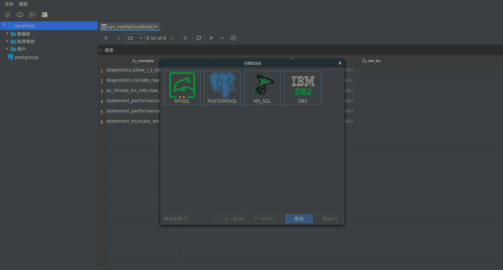
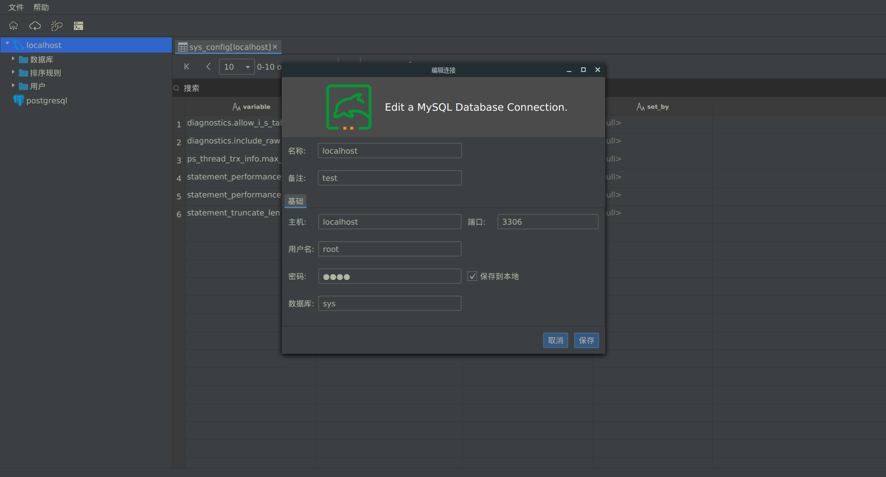
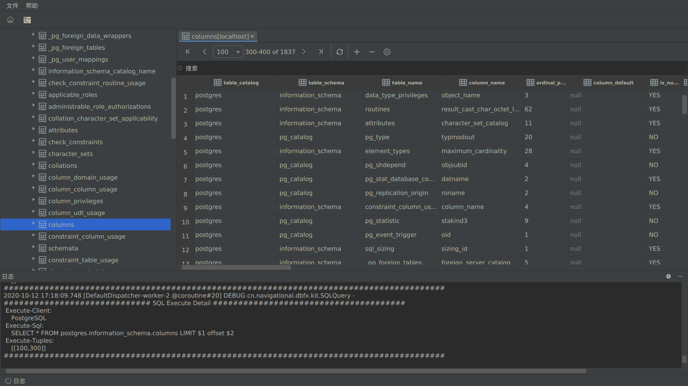
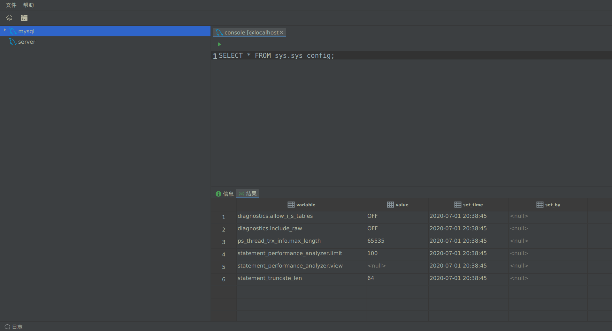
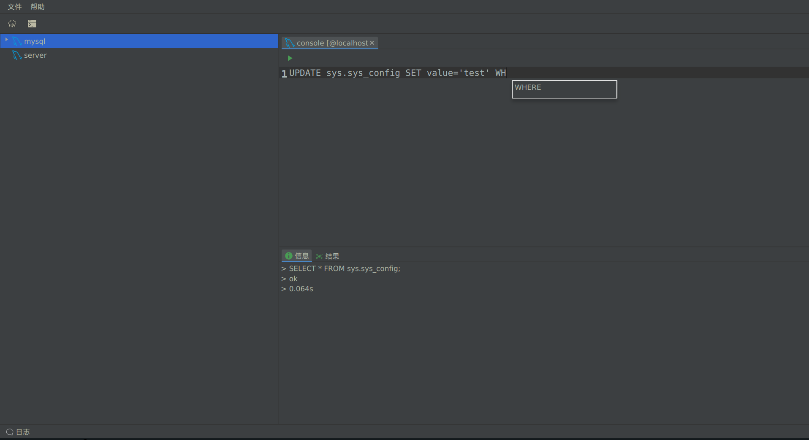
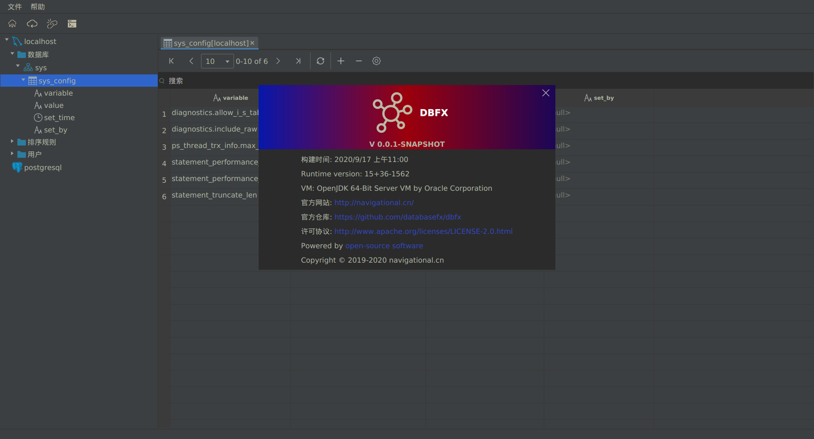

# dbfx

This is a free, cross platform, open source database management tool based on JavaFX and vertx SQL client.

## Build
To build DatabaseFX, execute the following command:
```
gradlew build
```
To run the product, execute the following command:
```
gradlew run
```
NOTE : DatabaseFX requires Java 15 and above.

## Snapshots

### Create  connection


### Edit connection


### Data table


### SQL Statement real time output


### SQL Statement Terminal
#### Execute Result


#### Smart Tips


### About



